Gerard Braad
============

![header][assets header]

## Background

  Gerard is a skilled professional in software development practices and methodologies,
  with extensive experience in facilitating the transition of companies towards an Open
  Source support and service business model.
  
  He has demonstrated expertise in managing projects and is recognized by his colleagues
  as a proficient full-stack engineer. By prioritizing the delivery of secure and
  high-quality solutions, he has successfully provided tailored solutions to customers
  ranging from small-scale to enterprise-level.

## Recent employment history
  * [Red Hat][link redhat] - Manager, Software Engineering  
    January 2017 - Present · 8+ years
  * [UnitedStack][link ustack] - Technical Director  
    November 2015 - December 2016 · 1 yr 2 mos
  * ThoughtWorks - Senior Full-stack Engineer  
    November 2013 - September 2015 · 1 yr 10 mos
  * ...

## Who am I?

```mermaid
mindmap
   root)@gbraad(
      (Hobbies)
         (𝑨𝑴𝑰𝑮𝑨)
         Electronics
         RC cars
         (...)
      (Employment)
         Sogyo
         ThoughtWorks
         (Red Hat)
            Principal Software Engineer
            Engineering Manager
      (Open Source)
         Linux
         Fedora
         OpenStack
         Containers
         Virtualization
```

## Portfolio

## Organizations
  * [spotsnel][link spotsnel] - Networking and hosting projects
  * [spotsnel-apps][link ssapps] - application related repositories
  * [spotsnel-fedora][link ssfedora] - Fedora and EL related network projects
  * [spotsnel-gaming][link ssgaming] - gaming related hosting projects
  * [spotsnel-services][link ssservices] - service related hosting projects
  * [gbraad-apps][link apps] - application related repositories
  * [gbraad-docs][link docs] - documentation related repositories
  * [gbraad-fedora][link fedora] - generic Fedora related projects
  * [gbraad-devenv][link devenv] - instant development environments
  * [gbraad-gaming][link gaming] - gaming related repositories
  * [gbraad-teaching][link teaching] - teaching related material
  * [gbraad-homelab][link homelab] - homelab related material

## Work-related organizations
  * [crc-org][link crcorg] - Development of CRC/OpenShift Local
  * [containers][link containers] - Containers
  * [jkube][link jkube] - Management of JKube team
  * [machine-drivers][link mcndrv] - Machine drivers

## Links 
  * [Website][personal website]
  * [LinkedIn][linkedin profile]

[personal photo]: https://avatars.githubusercontent.com/u/128299119?s=200&v=4 "Profile photo"
[assets header]: https://github.com/gbraad/gbraad/raw/master/assets/header.svg "Profile header"
[personal website]: http://gbraad.nl "Personal website"
[linkedin profile]: http://linkedin.com/in/gbraad/ "LinkedIn"
[link resume]: https://github.com/gbraad/resume/blob/master/resume.md#employment-history "Resume"
[link ustack]: https://github.com/gbraad-unitedstack "gbraad @ UnitedStack"
[link redhat]: https://github.com/gbraad-redhat "gbraad @ Red Hat"
[link fedora]: https://github.com/gbraad-fedora "gbraad @ fedora"
[link gaming]: https://github.com/gbraad-gaming "Gaming related"
[link apps]: https://github.com/gbraad-apps "Applications"
[link docs]: https://github.com/gbraad-docs "Documentation"
[link teaching]: https://github.com/gbraad-teaching "Teaching material"
[link homelab]: https://github.com/gbraad-homelab "Homelab material"
[link devenv]: https://github.com/gbraad-devenv "Developer environments"
[link crcorg]: https://github.com/crc-org "CRC / OpenShift Local"
[link containers]: https://github.com/containers "Containers"
[link jkube]: https://github.com/jkubeio "JKube"
[link spotsnel]: https://github.com/spotsnel "SpotSnel"
[link ssapps]: https://github.com/spotsnel-apps "SpotSnel applications"
[link ssfedora]: https://github.com/spotsnel-fedora "spotsnel @ Fedora"
[link ssgaming]: https://github.com/spotsnel-gaming "SpotSnel gaming"
[link ssservices]: https://github.com/spotsnel-services "SpotSnel services"
[link mcndrv]: https://github.com/machine-drivers "Machine drivers"
